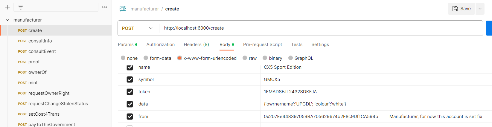

# NFTVehicleM: Architecture for accessing the NFT-Vehicle
## General description
  This is the source code of NFTVehicleM, an architecture containing all services for accessing the NFT-Vehicle. This contains mainly three parts:  
  - An API-Gateway service, we have called NFTVehicleM; and 
  - A blockchain server access. This uses Ganache program (application part of Truffle Suite). 
  - A simulator tool

## Folders
  It is composed by the following folders:

  - ganache/
  - nftvehicle/
  - NFTVehicles_simulator/

## Install
  To install each part execute the following instructions: 
  
  1. Firstly install docker, a guide for that visit https://docs.docker.com/engine/install/
  2. Install Ganache: follow the instructions explained in file README.md within folder ganache/.
  3. Install NFTVehicleM, for that follow the instructions explained in file README.md within folder nftvehicle/.
  4.- Install the simulator tool, for that follow the instructions explained in file README.md within folder NFTVehicles_simulator/. This part is not required to run NFTVehicleM, at least you can execute some testing proofs.

## Example
  To consume the services provided by NFTVehicleM you can use Postman application (https://www.postman.com/). The following figure illustrates an example of tokenizing a vehicle by sending a request as you can see in the following image:
  

  You can see all NFTVehicleM services at https://auditblockchain.postman.co/workspace/NFTVehicles~74903020-71ed-4d7d-b8ca-f7d5b27c2c17/collection/9485273-ae05999d-a773-4094-8d18-896e37bb0891?action=share&creator=9485273 